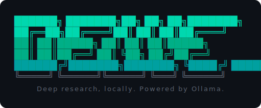
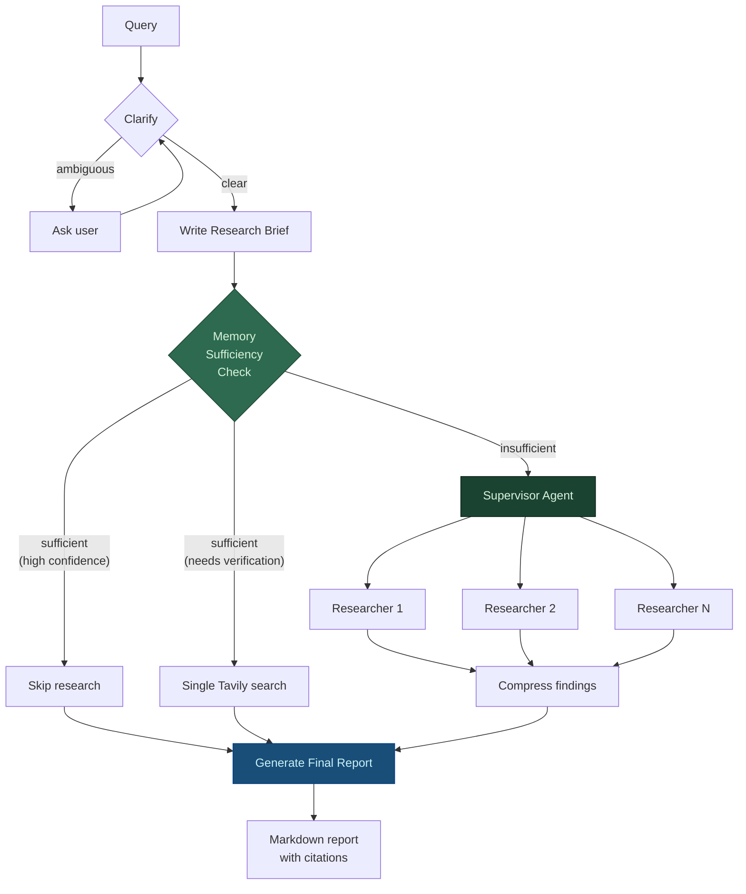
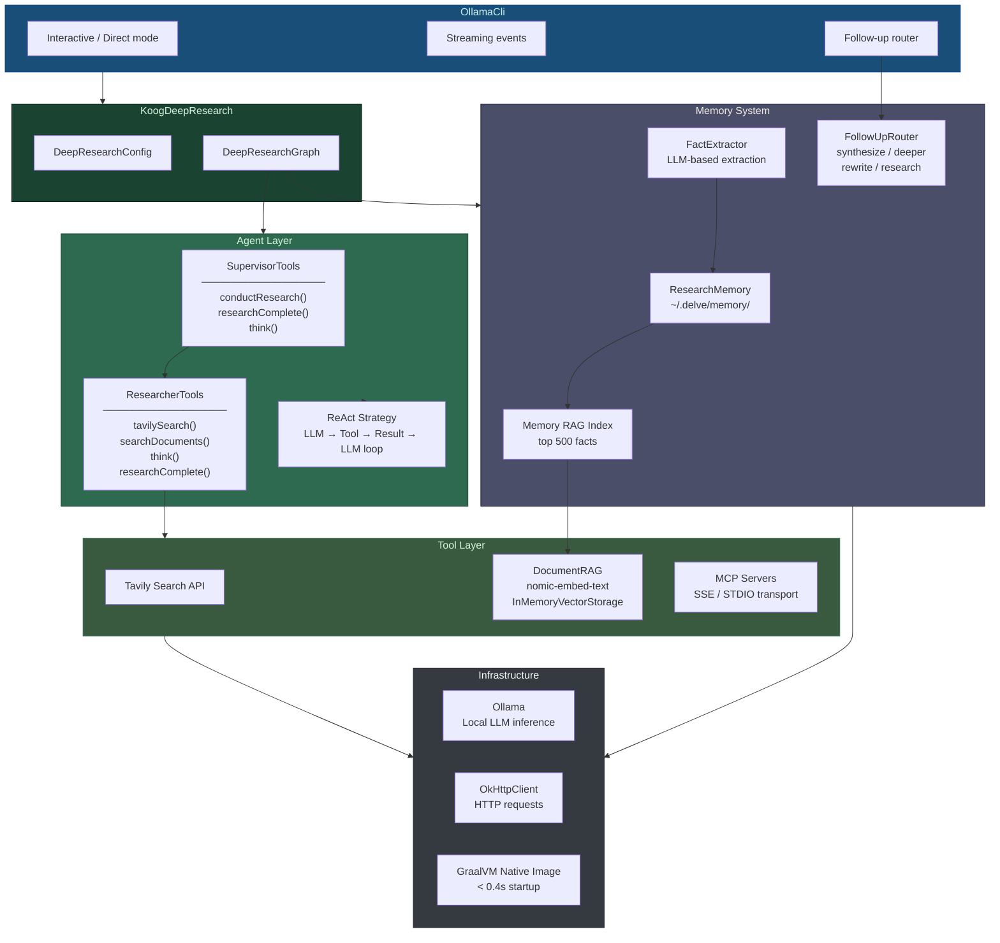
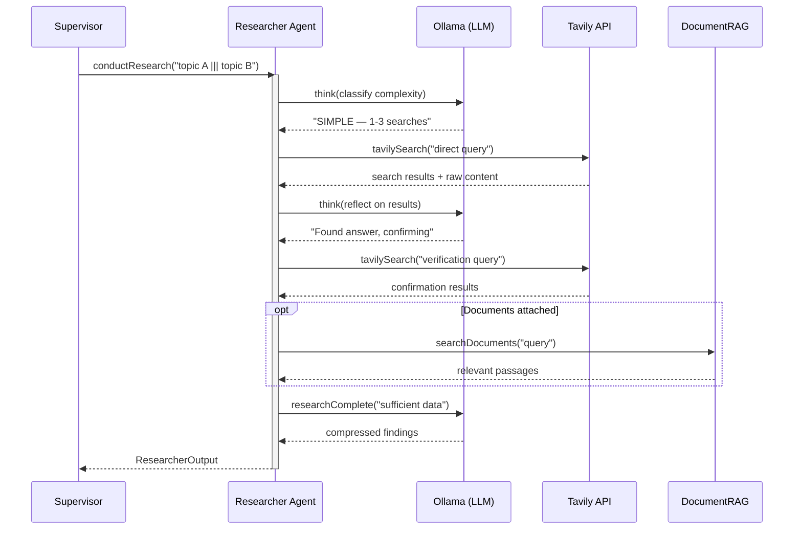
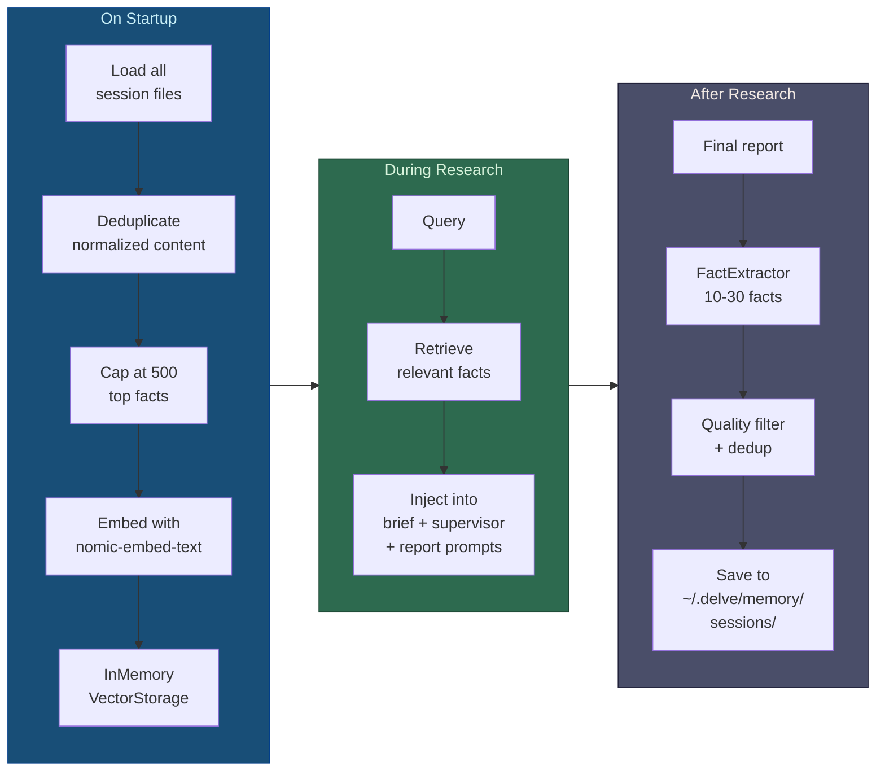

<p align="center">
  
</p>

<p align="center">
  <strong>Deep research, locally. Powered by Ollama.</strong>
</p>

Delve is an AI research agent that runs entirely on your machine. Give it a question, and it searches the web, reads sources, and writes a comprehensive research report — using any local LLM through Ollama.

```
delve "What are the latest advances in solid-state batteries?"
```

**Instant startup** — compiles to a native binary via GraalVM, launches in under 0.4 seconds. No JVM cold start.

No cloud AI APIs. No data leaves your machine (except web searches). Your models, your hardware, your research.

---

## How it works

Delve uses a multi-agent pipeline to produce thorough research:

1. **Clarify** — Analyzes your query, asks for clarification if ambiguous
2. **Plan** — Breaks the topic into focused research questions
3. **Research** — Dispatches parallel researcher agents that search the web, read pages, and extract findings
4. **Report** — Synthesises everything into a cited, structured report

Each researcher agent uses a ReAct loop: think about what to search, search, reflect on results, repeat. A supervisor coordinates multiple researchers in parallel and decides when coverage is sufficient.

## Quick start

### Install

**Option A: Pre-built binary** (fastest)

Download the latest release for your platform from [Releases](https://github.com/kashif-e/delve/releases), extract, and add to your PATH:

```bash
# macOS Apple Silicon
tar xzf delve-macos-arm64.tar.gz
mv delve ~/.local/bin/

# Linux x64
tar xzf delve-linux-x64.tar.gz
mv delve ~/.local/bin/
```

**Option B: Build from source** (one command)

Installs all dependencies (SDKMAN, GraalVM JDK 25), builds a native binary, and adds `delve` to your PATH.

```bash
git clone https://github.com/kashif-e/delve.git
cd delve && ./install.sh
```

Works on **macOS**, **Linux**, and **Windows** (Git Bash / WSL). Falls back to JVM if native compilation fails.

```bash
./install.sh --jvm        # skip native build, use JVM mode
./install.sh --uninstall  # remove delve and its config
```

> **Note:** Native compilation takes 2–5 minutes and ~10GB RAM. Machines with less than 10GB automatically fall back to JVM mode.

### Prerequisites

The only thing `install.sh` doesn't handle:

- **Ollama** — [ollama.ai/download](https://ollama.ai/download)
- **Tavily API key** — Free at [tavily.com](https://tavily.com) (1,000 searches/month)

### Run

```bash
ollama serve                    # start Ollama (if not running)
ollama pull llama3.1            # download a model

delve                           # interactive mode
delve "your research question"  # direct mode
```

Delve will prompt for your Tavily key on first run and save it to `~/.config/delve/config.json`.

## Cloud models

Don't have a GPU? Ollama supports cloud-hosted models that run on remote infrastructure — no local hardware required.

```bash
ollama pull qwen3-coder:480b-cloud   # no download, runs remotely
ollama pull kimi-k2.5:cloud
delve --model qwen3-coder:480b-cloud "your question"
```

Cloud models appear alongside local models in the Delve model picker, tagged as `cloud`. They require an internet connection but no GPU or disk space. See [ollama.com/blog/cloud-models](https://ollama.com/blog/cloud-models) for the full list.

## CLI reference

### Commands

```bash
delve                                    # interactive mode (model picker + prompt)
delve "your question"                    # direct mode
delve "question" @file.pdf @notes.md     # attach files as context
delve --model qwen2.5:14b "question"     # use a specific model for this session
delve --set-model qwen2.5:14b            # set default model
delve --set-key tvly-your-key            # update Tavily API key
```

### Follow-up commands

After a report is generated, Delve enters a follow-up loop:

| Command      | Description                              |
| ------------ | ---------------------------------------- |
| `/sources`   | List all URLs cited in the report        |
| `/save`      | Save the report to `~/delve-reports/`    |
| `/export`    | Copy the report to clipboard             |
| `/memory`    | View memory stats (sessions, facts)      |
| `/forget`    | Clear current session from memory        |
| `/key`       | Update Tavily API key                    |
| `/exit`      | End session (or just press Enter)        |

Any other input is treated as a follow-up — Delve automatically classifies it and routes to the right action: synthesize from existing findings, rewrite the report, go deeper on a section, or conduct fresh research.

## Research depth

Choose how deep Delve goes on each query:

| Depth      | Researchers        | Tool calls | Best for                            |
| ---------- | ------------------ | ---------- | ----------------------------------- |
| **Quick**  | Up to 5 parallel   | 7          | Factual questions, quick lookups    |
| **Normal** | Up to 7 parallel   | 15         | Explanations, comparisons, how-tos  |
| **Deep**   | Up to 10 parallel  | 25         | Multi-faceted analysis, full reports|

## Attach files

Provide local files as context with `@`:

```bash
delve "summarize the key findings" @paper.pdf @notes.md
delve "compare these configs" @old.yaml @new.yaml
delve "analyze this codebase" @src/*.py
```

Files are chunked and indexed with semantic search (via `nomic-embed-text`), so researchers can query your documents alongside web results.

## Memory

Delve remembers facts across sessions. When you research a topic, relevant findings from past sessions are automatically retrieved and provided as context. If past facts already answer your query, Delve skips full research entirely — or runs a single verification search to confirm — so repeat and follow-up questions are answered in seconds instead of minutes. Memory uses local RAG with `nomic-embed-text` embeddings — no data leaves your machine.

## MCP servers

Connect external tools via Model Context Protocol. Add servers to `~/.config/delve/config.json`:

```json
{
  "mcpServers": {
    "filesystem": {
      "transport": "stdio",
      "command": "npx",
      "args": ["-y", "@modelcontextprotocol/server-filesystem", "/path/to/dir"]
    },
    "web-search": {
      "transport": "sse",
      "url": "http://localhost:3001/sse",
      "tools": ["search", "fetch"]
    }
  }
}
```

MCP tools are loaded once at the supervisor level and shared across all researcher agents.

## Configuration

All config lives in `~/.config/delve/config.json`:

```json
{
  "tavilyApiKey": "tvly-...",
  "defaultModel": "llama3.1:8b",
  "maxConcurrentResearch": 3,
  "maxSupervisorIterations": 10,
  "maxToolCalls": 20,
  "temperature": 0.0,
  "enableClarification": true
}
```

## Reports

Reports are automatically saved to `~/delve-reports/` as Markdown files and copied to your clipboard. Each report includes inline citations and a sources section.

## Library usage

Use Delve as a Kotlin library in your own projects:

```kotlin
val delve = KoogDeepResearch.create {
    tavilyApiKey = "tvly-..."
    researchModel = myModel
    maxConcurrentResearchUnits = 5
}

// Blocking
val report = delve.research("your query").finalReport

// Async
val state = delve.researchAsync("your query")

// Streaming
delve.researchStream("your query")
    .collect { event ->
        when (event) {
            is DeepResearchEvent.SourceFound -> println("Found: ${event.url}")
            is DeepResearchEvent.Completed -> println(event.state.finalReport)
            else -> {}
        }
    }
```

## Architecture

Built on [Koog](https://github.com/JetBrains/koog) — JetBrains' Kotlin AI agent framework. Compiles to a native binary via GraalVM for instant startup (<0.4s).

### Research pipeline

The core pipeline runs every query through up to four stages, with an intelligent memory gate that can short-circuit expensive research:



### System architecture



### ReAct agent loop

Each researcher agent runs a ReAct (Reason + Act) loop. The supervisor uses the same pattern but with different tools:



### Memory lifecycle



### Project structure

```
src/kotlin/ai/kash/delve/
├── KoogDeepResearch.kt          # Public API — create(), research(), researchStream()
├── cli/
│   └── OllamaCli.kt             # Interactive CLI, model picker, streaming output
├── config/
│   └── DeepResearchConfig.kt    # All configuration — models, limits, timeouts, MCP
├── graph/
│   ├── DeepResearchGraph.kt     # Pipeline orchestrator — clarify → brief → memory → report
│   ├── SupervisorSubgraph.kt    # Supervisor agent — delegates parallel research tasks
│   ├── ResearcherSubgraph.kt    # Researcher agent — web search, RAG, compression
│   └── ReactStrategy.kt         # ReAct loop — LLM → tool → result → LLM
├── memory/
│   ├── ResearchMemory.kt        # Persistent fact store with RAG indexing
│   ├── FactExtractor.kt         # LLM-based fact extraction from reports
│   ├── FollowUpRouter.kt        # Routes follow-ups: synthesize/deeper/rewrite/research
│   ├── MemoryModels.kt          # ResearchFact, ConversationTurn, SessionRecord
│   └── MemoryPrompts.kt         # Prompts for extraction, routing, synthesis
├── model/
│   └── ResearchModels.kt        # ClarificationDecision, MemorySufficiencyDecision, etc.
├── prompts/
│   └── ResearchPrompts.kt       # All system prompts — clarify, brief, research, report
├── rag/
│   └── DocumentRAG.kt           # Vector search over attached files and memory facts
├── state/
│   └── DeepResearchState.kt     # AgentState — messages, summaries, rawNotes, report
├── tools/
│   └── MCPTools.kt              # MCP server loader — SSE and STDIO transports
└── utils/
    └── DeepResearchUtils.kt     # Tavily API, OkHttp client, retry logic, helpers
```

## Requirements

- Ollama with at least one model pulled
- Tavily API key (free tier: 1,000 searches/month)
- ~8GB RAM for 8B models, ~16GB for 14B models

Everything else (GraalVM JDK 25) is handled by `install.sh`.

## License

Apache 2.0 — see [LICENSE](LICENSE) for details.
